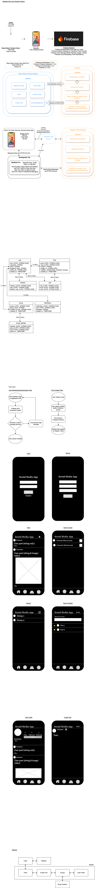

# pmo. — Social Media App Focused on Privacy and Community

## Project Overview

pmo. is a mobile-first social media application designed to give users greater control over who can view their posts.  
The app allows users to create content visible to the public, followers only, or specific user-created groups, helping build safer and more focused communities.

## Problem Being Solved

Most social media platforms offer limited or confusing privacy settings.  
pmo. solves this by offering advanced but easy-to-use visibility controls, letting users customize who sees each post.

## Technologies Used

- React Native
- Firebase (Authentication, Firestore Database, Storage)
- Expo for development and testing
- GitHub for version control

## Functional Requirements Delivered

- Secure registration and login
- Create posts with text, images, or video
- Set post visibility (Public, Followers-Only, or Specific Groups)
- View a feed based on visibility settings
- Real-time Activity Center for tracking likes
- Group creation and group-specific feeds
- Profile management (edit bio, update profile picture, reset password)
- Mobile-first design with bottom tab navigation

## Non-Functional Requirements Delivered

- Real-time database updates with Firestore listeners
- Secure authentication and data storage
- Optimized for mobile use across iOS and Android
- User-friendly and intuitive design

## Industry Best Practices

- Model-View-Controller (MVC) architectural patterns
- Modular, scalable code structure
- Git and GitHub for version control and collaboration
- Manual testing to verify functionality against user stories

## Cloud Deployment

- Firebase backend services
- GitHub public repository

## New Technologies Learned

- React Native (Mobile Development)
- Firebase Authentication and Firestore Database
- Expo development tools
- Real-time updates with Firestore `onSnapshot`

## Technical Approach

- React Native frontend integrated with Firebase backend
- Firestore used for post storage, group data, and user profiles
- Cloud Storage used for uploading and managing media
- Firebase Authentication for secure login and user management
- Bottom tab navigation used for core app navigation

## Architecture Diagram

## Risks and Challenges

- Learning new backend services with Firebase
- Handling real-time updates and database listening
- Staying within project scope and timeline

Challenges were handled through documentation review, online tutorials, and iterative development.

## Outstanding Issues

- No major issues outstanding.
- Post deletion, comment threads, and GDPR compliance were considered out of scope.

## Demo Video

[Demo Video](https://www.youtube.com/watch?v=TsNouCzqWQ0)

## Project Presentation Screencast

[Watch the Full Presentation Here](https://youtu.be/IT8CsNFYFUc)

## Repository

[GitHub Repo](https://github.com/BrayanE02/pmo.)
